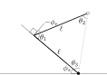

# brachiograph

A library for brachiographs.

## The geometry

Our brachiograph is parameterized like this:

The filled black circle is at the origin (and the shoulder joint), and the white circle is at the hand.
We'll call the bit between the shoulder and the elbow the "humerus";
the part between the elbow and the hand is the "ulna". Since it makes the calculations easier, we'll assume that
the humerus and the ulna have the same length, which we call $\ell$.
The clockwise angle from the negative $x$ axis to the humerus is called $\phi_s$.
The elbow's angle is a little more complicated to describe in words, but see the picture where $-\phi_e$ is labelled.
The point of these conventions is that the "resting" position (in which the humerus points to the left and the ulna points up)
has $\phi_s = \phi_e = 0$; and the reason behind the sign of $\phi_e$ is because the rotating tip of the elbow servo is
glued to the humerus. That is, if we tell the elbow servo to rotate $\phi$ degrees counter-clockwise then the ulna (which
is attached to the body of the servo and not the turny part) will turn clockwise instead. With our conventions,
$\phi_s$ and $\phi_e$ (without the minus sign) refer to the servos' rotation angles.

To map from Cartesian coordinates to angles, let $p = (x, y)$ be the position of the hand (with positive $y$ pointing up),
and look at the triangle induced by the shoulder, the elbow, and the hand. Since we know all three lengths (two of them
are $\ell$ and the third is $\sqrt{x^2 + y^2}$), the angles are determined. Specifically, if we label the inner
angles $\theta_1$, $\theta_2$, and $\theta_3$ as in the image above
then the cosine rule gives $\cos \theta_1 = \frac{2 \ell^2 - x^2 - y^2}{2 \ell^2}$,
so we can solve this for $\theta_1$ and then set $\phi_e = \theta_1 - \pi/2$.
To solve for $\theta_2$, notice that the triangle is isosceles (because we assumed that the humerus and the ulna
are the same length), and so $\theta_2 = \theta_3$. Therefore $\pi = \theta_1 + 2 \theta_2$ and we can solve for $\theta_2$.
Finally, we solve for $\phi_s$ by observing that $\tan^{-1} (y/x) + \theta_2 + \phi_s = \pi$.

Eliminating the temporary $\theta$ variables and simplifying, we have

$$
  \phi_e = - \sin^{-1} \left( 1 - \frac{x^2 + y^2}{2 \ell^2} \right)
$$

and

$$
  \phi_s = \frac{3 \pi}{4} + \frac{\phi_e}{2} - \tan^{-1}(y/x)
$$

(note that our $\tan^{-1}$ is assumed to give values between $0$ and $\pi$).
